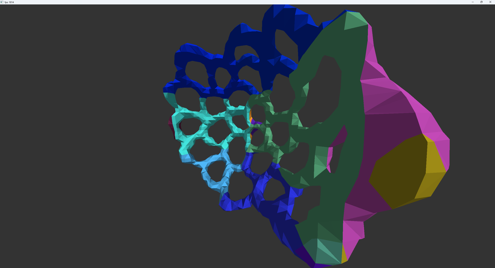

# MCubeEditor

Small editor that can build and destroy a volume represented by the marching cubes algorithm. Entire app is made in a custom vulkan engine. Purpose of the project is to explore the vulkan api and general application architecture.

### Features include
- Freecam controls used to add and destroy a marching cube volume.
- Basic job system to speed up volume re-meshing.
- Seperate main and render threads.
- Basic diffuse lighting.
- Vulkan backend implementation inspired heavily by Sascha Willems examples https://github.com/SaschaWillems/Vulkan
- Dynamic shader parsing into render passes.

## How to build
Run included pm5.lua through Premake5, tested on VisualStudio2022.
Build and run MCubeEditor csproj-

-- Not tested on any pc other than mine though.

## Controls
- wasd to move
- shift/space to move up and down
- Holding right click + move mouse to look
- q and e to move "cursor" closer or further away from camera
- left click: add volume
- ctrl + left click: remove volume
